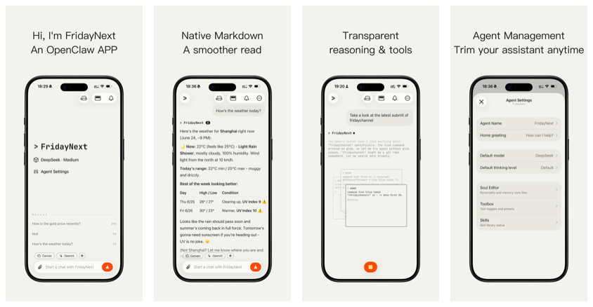

# FridayNext — an iOS client for OpenClaw

FridayNext is an independent iOS app for OpenClaw. It streams every answer live, shows you
the thinking behind it, and keeps your agent one tap away — anywhere you go.

[](https://apps.apple.com/us/app/fridaynext/id6768689875)

---

## Why FridayNext

**Your agent, not a stranger's.** FridayNext talks to *your own* OpenClaw gateway. Self-hosted
and private by default — your conversations, your data, your rules. No middleman, no lock-in.

**Watch it think.** Answers stream in real time with the agent's reasoning, tool calls, and
subagent work laid out as they happen. You don't just get the result — you see how it got
there, and you can jump in at any moment.

**More than chat.**

| Feature | Why |
| --- | --- |
| 🎨 **Interactive canvas** | Your agent pushes live web content, dashboards, and interactive UIs right into the conversation. |
| 🗣️ **Talk in real time** | Full voice conversations with your agent — speak naturally, and it can run tools and check facts mid-call before answering. |
| 🔊 **Listen to answers** | Built-in text-to-speech reads responses aloud while you're on the move. |
| 📅 **Calendar & Reminders** | Your agent reads your schedule and writes back: "what's today look like?" and "remind me to call the bank Tuesday" become real events and reminders, alarms included. |
| ❤️ **Health, both ways** | Ask about sleep, steps, or caffeine — the agent reads Apple Health, and can log meals, water, caffeine, and body measurements back into it. |
| ⏰ **Scheduled tasks** | Set recurring jobs from your phone and let your agent work on a schedule. |
| 🔔 **Proactive notifications** | Your agent reaches out when something needs you — right in your notification inbox. |
| 📎 **Share anything** | Send links, text, photos, and files to your agent straight from the iOS share sheet. |
| 🌍 **Reach it anywhere** | Optional FridayTunnel relay keeps you connected to your gateway when you're away from home. |
| 🗂️ **Organize your AI** | Multiple agents, multiple servers, per-agent settings, and history that syncs across your devices. |
| 🖼️ **Beautiful by design** | A native iOS experience built for speed and elegance — from the first message to the last. |

Calendar, Reminders, and Health access are agent **tools** (`fridaynext_calendar_query/log`,
`fridaynext_health_query/log`): they run over your own Friday SSE channel to your paired
iPhone, behind separate read and write toggles you control in the app — the phone has to
be online, and nothing is written without the write toggle on.

## A glimpse inside

<p align="center">
  
</p>

<p align="center"><em>Your agents, your chats, your tools — all in one place.</em></p>

## Download

[](https://apps.apple.com/us/app/fridaynext/id6768689875)

Available now on the App Store for iPhone. Free to download.

---

## What's this package?

`@syengup/friday-channel-next` is the OpenClaw side of FridayNext: a channel plugin that
connects the app to your own OpenClaw gateway. Install it once, pair your iPhone, and your
agent is in your pocket — with your phone acting as an OpenClaw **channel** (chat, voice,
calendar/Health/location tools over HTTP + SSE), so your agent can talk with you by voice,
and read or write your calendar, reminders, Apple Health, and your current location when
you allow it. (The OpenClaw **node** WebSocket surface is retained as a legacy-compat
service for un-upgraded clients; current app builds are HTTP + SSE only.)

```bash
npx -y @syengup/friday-channel-next
```

One command for every platform (macOS, Linux, native Windows) — the installer probes
npmjs.org vs npmmirror itself and installs from the faster one, so it works in mainland
China too.

Then open FridayNext and follow the in-app setup — no command line required after that.

## Links

- **Download the app:** <https://apps.apple.com/us/app/fridaynext/id6768689875>
- **OpenClaw:** <https://openclaw.ai>
- **Plugin source:** <https://github.com/SyengUp/openclaw-fridaynext-channel>

---

*For developers: the plugin's API contract lives in [`API.md`](API.md) and
[`API.zh-CN.md`](API.zh-CN.md).*
